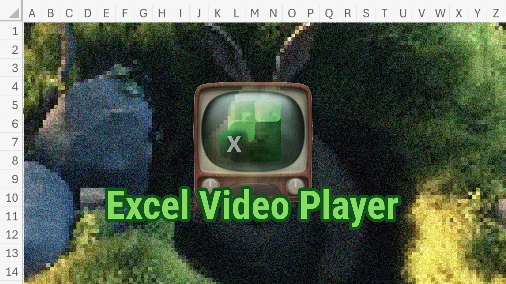
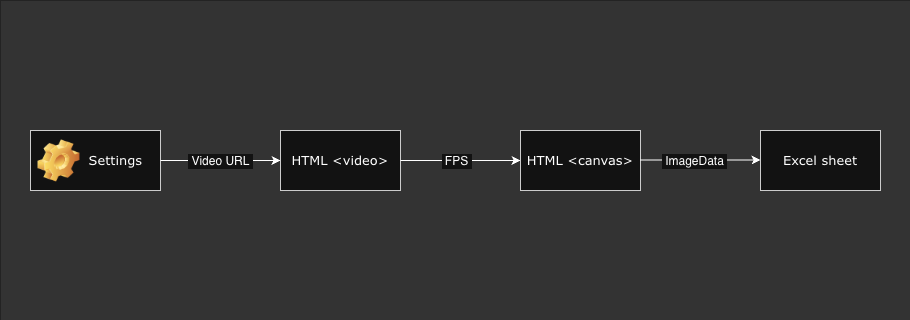

# Excel Video Player

<p align="center">

</p>
<p align="center">
📺 Add-in to visualize videos in Excel sheets.
</p>

## Table of Contents

- [Why](#why)
- [Benchmarks](#benchmarks)
- [How it Works](#how-it-works)
- [Stack](#stack)
- [How To Run This Project](#how-to-run-this-project)
- [Build Excel Add-ins Using Office Add-ins Development Kit](#build-excel-add-ins-using-office-add-ins-development-kit)
- [Code You Can Trust](#code-you-can-trust)
- [License](#license)

## Why

The real question is, **WHY NOT?**

Since Excel's inception, its grid system has been used for a wide variety of applications. So why not interpret it as a pixel matrix and **turn it into a monitor for playing videos**?

This is another challenge for tech geeks, where we'll have to use **algorithm optimization and image/video processing techniques** to overcome Excel's technical limitations and <u>achieve the best possible performance</u>.

Help me discover how far we can go.

## Benchmarks

The more resolution, the better!

|     |                        Developer                        | Resolution | FPS | Color depth | Platform | Other conditions |
| :-: | :-----------------------------------------------------: | :--------: | :-: | :---------: | :------: | :--------------: |
| 🥇  | [carlossalasamper](https://github.com/carlossalasamper) |   64x36    |  1  |   24-bit    |   Web    |        -         |
| 🥈  | [carlossalasamper](https://github.com/carlossalasamper) |   32x18    |  2  |   24-bit    |   Web    |        -         |
| 🥉  | [carlossalasamper](https://github.com/carlossalasamper) |    16x9    |  5  |   24-bit    |   Web    |        -         |
| #4  |                            -                            |     -      |  -  |      -      |    -     |        -         |
| #5  |                            -                            |     -      |  -  |      -      |    -     |        -         |
| #6  |                            -                            |     -      |  -  |      -      |    -     |        -         |
| #7  |                            -                            |     -      |  -  |      -      |    -     |        -         |
| #8  |                            -                            |     -      |  -  |      -      |    -     |        -         |
| #9  |                            -                            |     -      |  -  |      -      |    -     |        -         |
| #10 |                            -                            |     -      |  -  |      -      |    -     |        -         |

### Can You Do It Better? Prove It.

💻 Make the necessary changes in a new branch, [create a pull request](https://github.com/carlossalasamper/excel-video-player/compare) and I'll validate the benchmark on my machine as soon as possible.

These are the requirements that a solution must meet to be considered valid:

- The **FPS must be constant for at least the first 15 seconds** of the [project's test video](./assets/videos/big-buck-bunny-360p.mp4).
- The number of **FPS must be equal to or greater than 1**.

<small>Approved optimizations will be included in the project and future developers will work on the current version.</small>

## How It Works

<p align="center">
   
</p>

1. User changes settings through the add-in task pane: resolution, FPS, cell size, video URL...
2. When the user clicks on "Play" button, the video URL is loaded in a [HTML `<video>` element](https://www.w3schools.com/html/html5_video.asp).
3. Depending on the selected FPS, the video is projected onto an [HTML `<canvas>` element](https://www.w3schools.com/html/html5_canvas.asp) at regular intervals.
4. After a canvas update, we get the current frame with [the canvas context function `getImageData`](https://developer.mozilla.org/en-US/docs/Web/API/CanvasRenderingContext2D/getImageData).
5. Finally we update the Excel sheet based on the [`ImageData`](https://developer.mozilla.org/en-US/docs/Web/API/ImageData) obtained.

<small>This is the current core flow of the add-in, but it is subject to change if we find a more optimal way to do it.</small>

## Stack

- 🧪 **Jest**: unit testing
- 🐻 **Zustand**: agnostic JavaScript state manager
- 🐶 **Husky**: run lint/test before a commit
- 🧰 **Office.js**: official add-ins framework
- 🛡️ **TypeScript**: catch runtime errors before they happen
- 🎨 **FluentUI**: cross platform UX framework

## How To Run This Project

### Prerequisites

- Node.js (the latest LTS version). Visit the [Node.js site](https://nodejs.org/) to download and install the right version for your operating system. To verify that you've already installed these tools, run the commands `node -v` and `npm -v` in your terminal.
- [Only desktop] Office connected to a Microsoft 365 subscription. You might qualify for a Microsoft 365 E5 developer subscription through the [Microsoft 365 Developer Program](https://developer.microsoft.com/microsoft-365/dev-program), see [FAQ](https://learn.microsoft.com/office/developer-program/microsoft-365-developer-program-faq#who-qualifies-for-a-microsoft-365-e5-developer-subscription-) for details. Alternatively, you can [sign up for a 1-month free trial](https://www.microsoft.com/microsoft-365/try?rtc=1) or [purchase a Microsoft 365 plan](https://www.microsoft.com/microsoft-365/buy/compare-all-microsoft-365-products).

### Run the Add-in Using Office Web

You can sideload an add-in in dev mode using [the free online version of Microsoft 365](https://www.microsoft.com/en-us/microsoft-365/free-office-online-for-the-web).

1. **Open Office on the web**. Open a document in Excel, OneNote, PowerPoint, or Word.
2. Select **Home > Add-ins**, then select **More Settings**.
3. On the Office Add-ins dialog, select Upload My Add-in.
4. Browse to the add-in manifest file, and then _select Upload_.
5. **Run in dev mode** the add-in with the command `start:web`.

```
yarn start:dev --document "DOCUMENT_URL"
```

Check [the full guide to sideload an Office add-in](https://learn.microsoft.com/en-us/office/dev/add-ins/testing/sideload-office-add-ins-for-testing).

### Run the Add-in Using Office Add-ins Development Kit Extension

1. **Open the Office Add-ins Development Kit**

   In the **Activity Bar**, select the **Office Add-ins Development Kit** icon to open the extension.

1. **Preview Your Office Add-in (F5)**

   Select **Preview Your Office Add-in(F5)** to launch the add-in and debug the code. In the Quick Pick menu, select the option **Excel Desktop (Edge Chromium)**.

   The extension then checks that the prerequisites are met before debugging starts. Check the terminal for detailed information if there are issues with your environment. After this process, the Excel desktop application launches and sideloads the add-in.

1. **Stop Previewing Your Office Add-in**

   Once you are finished testing and debugging the add-in, select **Stop Previewing Your Office Add-in**. This closes the web server and removes the add-in from the registry and cache.

## Build Excel Add-ins Using Office Add-ins Development Kit

Excel add-ins are integrations built by third parties into Excel by using [Excel JavaScript API](https://learn.microsoft.com/en-us/office/dev/add-ins/reference/overview/excel-add-ins-reference-overview) and [Office Platform capabilities](https://learn.microsoft.com/en-us/office/dev/add-ins/overview/office-add-ins).

## Code You Can Trust

You can trust this code. It's covered in tests.


## License

The Excel Video Player source code is made available under the MIT license.

Some of the dependencies are licensed differently, with the BSD license, for example.
